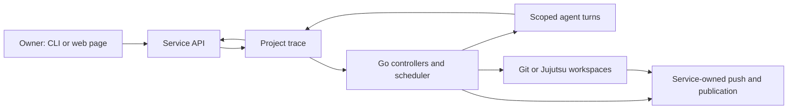

# Architecture

Osmia runs as one long-lived Go service. The command line and embedded web page
call its local API; agents do not drive the workflow. This page is a map for
operators and contributors. The [design](design.md) defines product behavior.

## From hand-in to delivery

The trace is a dedicated Git repository for each project under the Osmia root.
It contains the charter, knowledge base, workstream documents, transitions,
turn logs and durable operation intents. The target clone and its workspaces
are separate. The service reads current trace state on each reconciliation pass;
an event wakes a pass early but does not carry the state transition.

## Responsibilities

| Part | Owns | Main code |
| --- | --- | --- |
| Service | API, project lifecycle, owner gates, workflow controllers, landing and delivery | [service](../internal/service) |
| Trace and reconciliation | Versioned records, recoverable transactions, outbox operations and retry | [trace](../internal/trace), [reconcile](../internal/reconcile) |
| Scheduling | Readiness, capacity, priority and dispatch order across workstreams | [scheduler](../internal/scheduler) |
| Durable threads | Queued turns, owned logs, continuation and replay | [thread](../internal/thread) |
| Execution boundary | Scoped file views, tool grants, environment, sandbox verification | [isolation](../internal/isolation), [coreadapter](../internal/coreadapter) |
| Target workspaces | Service-owned Git and Jujutsu operations | [workspace](../internal/workspace) |
| Interfaces | Local client and browser page | [cli](../internal/cli), [web](../internal/web) |

The service uses a pinned `busybees/core` dependency for reusable execution,
MCP, sandbox and VCS primitives. Osmia keeps its state machine, owner decisions
and recovery policy in this repository.

## Decisions and side effects

An owner decision changes the workflow only through the service API. The trace
commits its transition and any outbox intent as one recoverable publication.
Reconciliation inspects durable intent and the external result before retrying
an operation. This matters for branch changes and publication, where repeating
an effect blindly could duplicate or invalidate work.

The scheduler reads queued turns and capacity from trace state. Its `Pass`
method publishes dispatch intent without running a model. Reconciliation hands
that intent to the thread runner, which executes a scoped turn and records its
response. Landing checks the reviewed candidate, base and governing document
revisions before merging it. A changed candidate returns to review. Delivery
requires the owner's approval of the final report and description.

## Agent boundary

The service selects a workspace and copies only approved files into a private
turn view. It chooses the role's tools and environment and checks the prepared
execution policy before the agent runs. Agents receive no VCS tool or delivery
credential. Writable output is captured by service code before the turn view is
removed; the service then updates the target workspace.

## Storage and deployment

The root defaults to `~/.local/share/osmia` and the top-level configuration to
`~/.config/osmia/config.toml`, following the XDG base directories; an explicit
root holds its own `config.toml`. Runtime overrides, project configuration,
project trace repositories and workspaces live in the root; the target clone
remains separate. The
service binds a Unix socket for local clients and can serve the same API on a
loopback listener or an embedded tailnet node. Tailnet membership controls access
to the remote page; there is no separate Osmia login. See
[configuration](configuration.md) and [getting started](getting-started.md).
